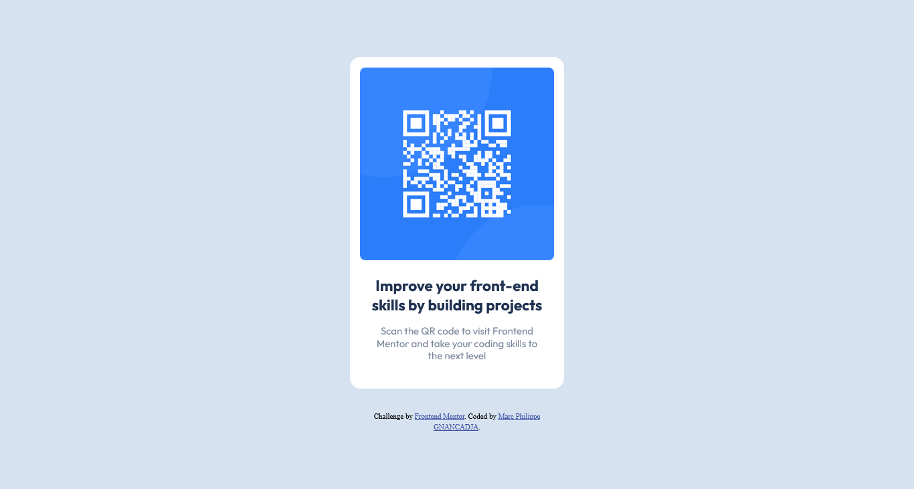

# Frontend Mentor - Product preview card component solution

This is a solution to the [Product preview card component challenge on Frontend Mentor](https://www.frontendmentor.io/challenges/product-preview-card-component-GO7UmttRfa). Frontend Mentor challenges help you improve your coding skills by building realistic projects. 

## Table of contents

- [Overview](#overview)
  - [The challenge](#the-challenge)
  - [Screenshot](#screenshot)
  - [Links](#links)
- [My process](#my-process)
  - [Built with](#built-with)
  - [What I learned](#what-i-learned)
  - [Continued development](#continued-development)
- [Author](#author)
 

## Overview

### The challenge

Users should be able to:

- View the optimal layout depending on their device's screen size
- See hover and focus states for interactive elements

### Screenshot

 
### Links

- Solution URL: [https://github.com/Marc-Philippe-dev/QR-code-component] 
- Live Site URL: [https://marc-philippe-dev.github.io/QR-code-component/] 

## My process

### Built with

- Semantic HTML5 markup
- CSS custom properties
- Flexbox
- Mobile-first workflow
 
 
### What I learned

I've learn how to efficiently  use flexbox to layout a page.

### Continued development

I want to deeply dive into flexbox in order to product beautiful and more complexe design.

 
 
## Author

- Frontend Mentor - [@Marc-Philippe-dev](https://www.frontendmentor.io/profile/@Marc-Philippe-dev)
- Twitter - [@MarcGnancadja](https://www.twitter.com/MarcGnancadja)

 